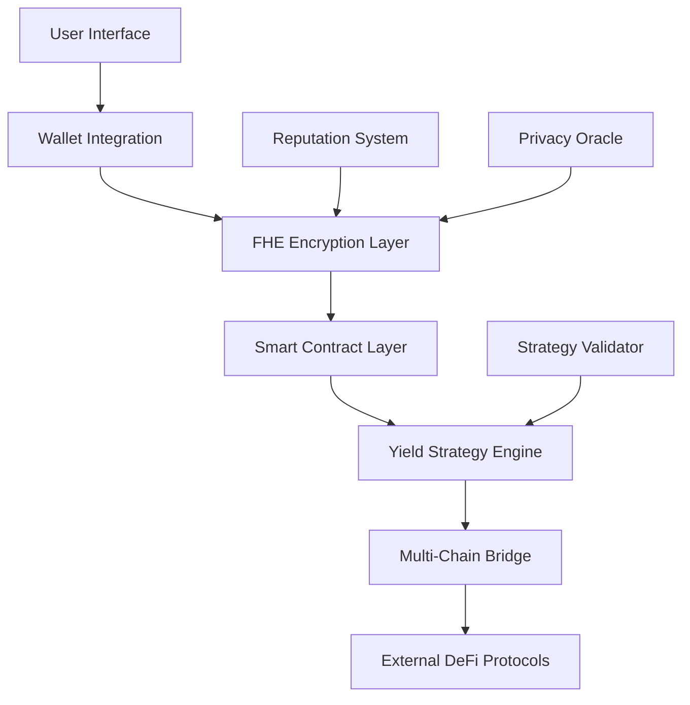

<div align="center">

# 🍃 Shielded Harvest Protocol

**Privacy-First DeFi Yield Farming with Fully Homomorphic Encryption**

[](https://opensource.org/licenses/MIT)
[](https://www.typescriptlang.org/)
[](https://reactjs.org/)
[](https://soliditylang.org/)

*Protect your competitive edge while maximizing DeFi yields through confidential farming strategies*

</div>

---

## 🎯 Vision

Shielded Harvest Protocol revolutionizes DeFi by enabling **private yield farming** through cutting-edge Fully Homomorphic Encryption (FHE) technology. Unlike traditional protocols where strategies are transparent and vulnerable to front-running, our platform ensures your farming strategies remain completely confidential while delivering optimal returns.

## ✨ Core Innovation

### 🔐 **Confidential Strategy Execution**
- **FHE-Encrypted Operations**: All sensitive calculations performed on encrypted data
- **Zero-Knowledge Proofs**: Verify transactions without revealing strategy details
- **Private Pool Management**: Create and manage yield pools with complete privacy

### 🚀 **Advanced Features**
- **Multi-Chain Support**: Deploy across multiple EVM-compatible networks
- **Dynamic Yield Optimization**: AI-driven strategy adjustments while maintaining privacy
- **Reputation System**: Encrypted reputation scoring for enhanced security
- **Emergency Protocols**: Secure withdrawal mechanisms with privacy preservation

## 🏗️ Technical Architecture



### 🛠️ Technology Stack

| Component | Technology | Purpose |
|-----------|------------|---------|
| **Frontend** | React 18 + TypeScript | Modern, type-safe UI development |
| **Styling** | Tailwind CSS + shadcn/ui | Responsive, accessible design system |
| **Wallet** | RainbowKit + Wagmi | Multi-wallet connectivity |
| **Blockchain** | Solidity 0.8.24 + FHEVM | Smart contract with homomorphic encryption |
| **Build Tool** | Vite | Fast development and optimized builds |
| **Testing** | Vitest + Playwright | Comprehensive testing suite |

## 🚀 Getting Started

### Prerequisites

- **Node.js** 18.0+ 
- **npm** 9.0+ or **yarn** 1.22+
- **Git** 2.30+

### Quick Installation

```bash
# Clone the repository
git clone https://github.com/your-org/shielded-harvest-protocol.git
cd shielded-harvest-protocol

# Install dependencies
npm install

# Configure environment
cp env.example .env
# Edit .env with your configuration

# Start development server
npm run dev
```

### Environment Setup

Create a `.env` file with the following configuration:

```env
# Network Configuration
VITE_CHAIN_ID=11155111
VITE_RPC_URL=https://sepolia.infura.io/v3/YOUR_INFURA_KEY

# Wallet Integration
VITE_WALLET_CONNECT_PROJECT_ID=YOUR_WALLET_CONNECT_PROJECT_ID

# API Keys
VITE_INFURA_API_KEY=YOUR_INFURA_API_KEY
```

## 📖 Usage Guide

### 1. **Wallet Connection**
```typescript
import { WalletConnect } from '@/components/WalletConnect'

// Connect your preferred wallet
<WalletConnect />
```

### 2. **Create Private Pool**
```solidity
// Deploy a new yield farming pool
function createPool(
    string memory _name,
    string memory _description,
    uint256 _lockPeriod,
    uint256 _duration
) public returns (uint256)
```

### 3. **Stake with Privacy**
```solidity
// Stake assets with encrypted amounts
function stake(
    uint256 poolId,
    externalEuint32 amount,
    bytes calldata inputProof
) public payable returns (uint256)
```

## 🔒 Security Model

### **Multi-Layer Protection**

1. **Encryption Layer**: All sensitive data encrypted using FHE
2. **Access Control**: Role-based permissions with multi-signature support
3. **Audit Trail**: Immutable transaction logs with privacy preservation
4. **Emergency Protocols**: Secure withdrawal mechanisms

### **Audit & Verification**

- ✅ **Smart Contract Audits**: Regular security assessments
- ✅ **FHE Implementation Review**: Cryptographic protocol validation
- ✅ **Penetration Testing**: Comprehensive security testing
- ✅ **Bug Bounty Program**: Community-driven security improvements

## 🛠️ Development

### Available Commands

```bash
# Development
npm run dev              # Start development server
npm run build           # Production build
npm run preview         # Preview production build

# Code Quality
npm run lint            # ESLint code analysis
npm run type-check      # TypeScript type checking
npm run test            # Run test suite
npm run test:e2e        # End-to-end testing

# Smart Contracts
npm run compile         # Compile Solidity contracts
npm run test:contracts  # Contract testing
npm run deploy:sepolia  # Deploy to Sepolia testnet
```

### Project Structure

```
shielded-harvest-protocol/
├── 📁 contracts/              # Smart contracts
│   ├── ShieldedHarvest.sol   # Main protocol contract
│   └── interfaces/           # Contract interfaces
├── 📁 src/                   # Frontend source
│   ├── 📁 components/        # React components
│   ├── 📁 hooks/            # Custom React hooks
│   ├── 📁 lib/              # Utilities and configs
│   ├── 📁 pages/            # Page components
│   └── 📁 types/            # TypeScript definitions
├── 📁 docs/                 # Documentation
├── 📁 tests/                # Test files
└── 📁 scripts/              # Deployment scripts
```

## 🌐 Deployment

### **Vercel Deployment**

1. **Connect Repository**: Link your GitHub repo to Vercel
2. **Configure Environment**: Set environment variables in dashboard
3. **Deploy**: Automatic deployment on push to main branch

### **Manual Deployment**

```bash
# Build the application
npm run build

# Deploy to your preferred hosting provider
# Upload the dist/ folder contents
```

### **Smart Contract Deployment**

```bash
# Deploy to Sepolia testnet
npm run deploy:sepolia

# Deploy to mainnet (after thorough testing)
npm run deploy:mainnet
```

## 🤝 Contributing

We welcome contributions from the community! Here's how you can help:

### **Ways to Contribute**

- 🐛 **Bug Reports**: Help us identify and fix issues
- 💡 **Feature Requests**: Suggest new functionality
- 📝 **Documentation**: Improve our docs and guides
- 🔧 **Code Contributions**: Submit pull requests
- 🧪 **Testing**: Help test new features and fixes

### **Development Workflow**

1. **Fork** the repository
2. **Create** a feature branch: `git checkout -b feature/amazing-feature`
3. **Commit** your changes: `git commit -m 'Add amazing feature'`
4. **Push** to the branch: `git push origin feature/amazing-feature`
5. **Open** a Pull Request

### **Code Standards**

- **TypeScript**: Strict type checking enabled
- **ESLint**: Follow our linting rules
- **Prettier**: Consistent code formatting
- **Testing**: Maintain test coverage above 80%

## 📊 Roadmap

### **Phase 1: Foundation** ✅
- [x] Core FHE implementation
- [x] Basic yield farming functionality
- [x] Wallet integration
- [x] UI/UX development

### **Phase 2: Enhancement** 🚧
- [ ] Advanced strategy optimization
- [ ] Multi-chain deployment
- [ ] Enhanced security features
- [ ] Performance optimizations

### **Phase 3: Expansion** 📋
- [ ] Cross-chain interoperability
- [ ] Institutional features
- [ ] Advanced analytics
- [ ] Mobile application

## 📄 License

This project is licensed under the **MIT License** - see the [LICENSE](LICENSE) file for details.

## 🔗 Community & Support

- **Website**: [Coming Soon]
- **Documentation**: [Coming Soon]
- **Discord**: [Join our community](https://discord.gg/shielded-harvest)
- **Twitter**: [@ShieldedHarvest](https://twitter.com/shieldedharvest)
- **GitHub Discussions**: [Community discussions](https://github.com/your-org/shielded-harvest-protocol/discussions)

## ⚠️ Important Notice

**This software is experimental and provided "as is" without warranty of any kind. Use at your own risk. Always conduct thorough testing before using with real funds. The developers are not responsible for any financial losses.**

---

<div align="center">

**Built with ❤️ by the Shielded Harvest Protocol Team**

*Empowering privacy in DeFi through innovative cryptography*

</div>
